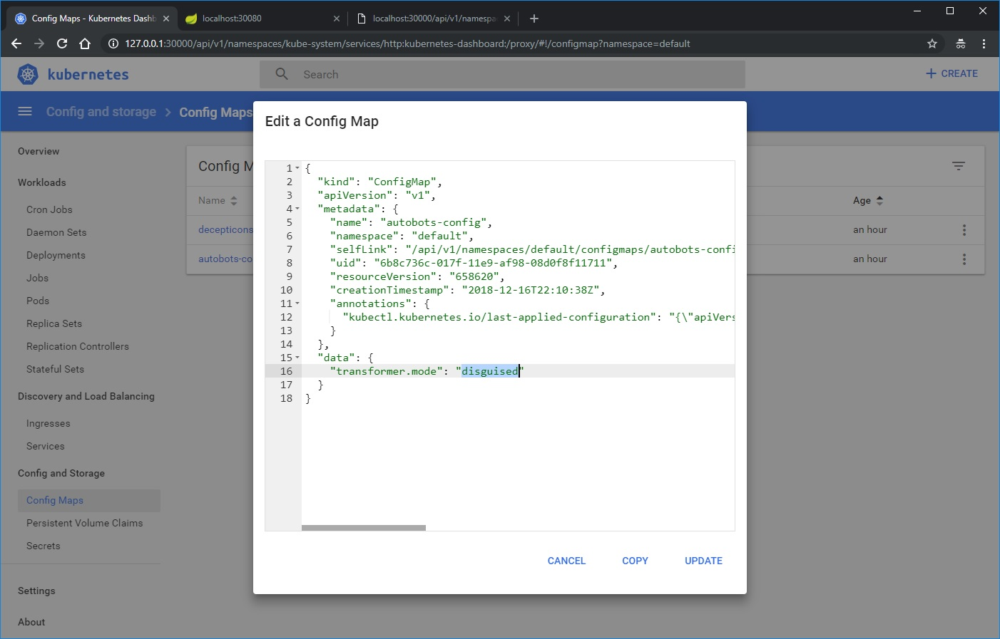

# k8s-config-maps
The project started with:
* [Optimus Prime](/optimus-prime/README.md)

## Commands:
```bash
# Autobots
$ kubectl create -f autobots-config.yml --save-config
configmap/autobots-config created
$ kubectl apply -f optimus-prime.yml
deployment.apps/optimus-prime created
service/optimus-prime-entrypoint created
$ kubectl apply -f ./autobots-k8s-configs/gears.yml
$ kubectl get pods -l serviceType=gears -w

# Decepticons
$ kubectl create -f ./decepticons-k8s-configs/decepticons-config.yml --save-config
$ kubectl apply -f ./decepticons-k8s-configs/megatron.yml
$ kubectl apply -f ../decepticons-k8s-configs/shockwave.yml
$ kubectl get pods
NAME                              READY     STATUS    RESTARTS   AGE
megatron-766478b685-6wnxb         0/1       Running   0          11s
megatron-766478b685-k4fnr         0/1       Running   0          11s
$ kubectl port-forward pod/megatron-766478b685-6wnxb :8080 &
Forwarding from 127.0.0.1:53899 -> 8080
Forwarding from [::1]:53899 -> 8080
$ kubectl delete -f ../decepticons-k8s-configs/megatron-prime.yml
deployment.apps "megatron" deleted
service "megatron-entrypoint" deleted
```

# Change config maps:

```bash
$ kubectl scale deployment/optimus-prime --replicas=0
deployment.extensions/optimus-prime scaled
15:40 $ kubectl get pods -l serviceType=optimus-prime
No resources found.
15:40 $ kubectl scale deployment/optimus-prime --replicas=3
deployment.extensions/optimus-prime scaled
15:40 $ kubectl get pods -l serviceType=optimus-prime -w
NAME                             READY     STATUS              RESTARTS   AGE
optimus-prime-7989f696bf-2n5wg   0/1       ContainerCreating   0          5s
optimus-prime-7989f696bf-plp69   0/1       ContainerCreating   0          5s
optimus-prime-7989f696bf-vxvbw   0/1       ContainerCreating   0          5s
optimus-prime-7989f696bf-vxvbw   0/1       Running   0          26s
optimus-prime-7989f696bf-plp69   1/1       Running   0         49s
optimus-prime-7989f696bf-2n5wg   1/1       Running   0         53s
```

## Rolling update with config maps v2:
Add `./decepticons-k8s-configs/decepticons-config-v2.yml`, and modify `megatron.yml` and `shockwave.yml` to use \
`decepticons-config-v2`
```bash
$ kubectl apply -f decepticons-k8s-configs --record
configmap/decepticons-config-v2 created
configmap/decepticons-config configured
deployment.apps/megatron configured
service/megatron-entrypoint configured
deployment.apps/shockwave configured
service/shockwave-entrypoint configured
$ kubectl get pods -l serviceType=megatron -w
NAME                        READY     STATUS    RESTARTS   AGE
megatron-766478b685-k4fnr   1/1       Running   0          2h
megatron-79f9d8dd8-8ck42    0/1       Running   0          26s
megatron-79f9d8dd8-qnsft    0/1       Running   0          26s
megatron-79f9d8dd8-qnsft   1/1       Running   0         59s
megatron-766478b685-k4fnr   1/1       Terminating   0         2h
megatron-766478b685-k4fnr   0/1       Terminating   0         2h
megatron-79f9d8dd8-8ck42   1/1       Running   0         1m
megatron-766478b685-k4fnr   0/1       Terminating   0         2h
megatron-766478b685-k4fnr   0/1       Terminating   0         2h
$ kubectl get pods -l serviceType=megatron
NAME                       READY     STATUS    RESTARTS   AGE
megatron-79f9d8dd8-8ck42   1/1       Running   0          2m
megatron-79f9d8dd8-qnsft   1/1       Running   0          2m
```

## Troubleshoot helm charts:
```bash
$ helm init
$HELM_HOME has been configured at /home/rwibawa/.helm.

Tiller (the Helm server-side component) has been installed into your Kubernetes Cluster.

Please note: by default, Tiller is deployed with an insecure 'allow unauthenticated users' policy.
To prevent this, run `helm init` with the --tiller-tls-verify flag.
For more information on securing your installation see: https://docs.helm.sh/using_helm/#securing-your-helm-installation
Happy Helming!

$ helm install --name=transformers1 ./transformers/
Error: could not find a ready tiller pod

$ kubectl -n kube-system get po
NAME                                    READY     STATUS    RESTARTS   AGE
tiller-deploy-74d5d98d7d-9bwfx          1/1       Running   0          2m

$ kubectl logs --namespace kube-system tiller-deploy-74d5d98d7d-9bwfx
```

## Helm Charts:
```bash
$ cd helm
$ helm install --name=transformers1 ./transformers/
NAME:   transformers1
LAST DEPLOYED: Sun Dec 16 19:21:34 2018
NAMESPACE: default
STATUS: DEPLOYED

RESOURCES:
==> v1/Deployment
NAME                        DESIRED  CURRENT  UP-TO-DATE  AVAILABLE  AGE
transformers1-optimusprime  2        0        0           0          1s

==> v1/Pod(related)
NAME                                         READY  STATUS   RESTARTS  AGE
transformers1-optimusprime-65454d4577-nfdqh  0/1    Pending  0         0s
transformers1-optimusprime-65454d4577-wvvq2  0/1    Pending  0         0s

==> v1/ConfigMap
NAME                              DATA  AGE
transformers1-autobots-config     1     1s
transformers1-decepticons-config  1     1s

==> v1/Service
NAME                        TYPE      CLUSTER-IP    EXTERNAL-IP  PORT(S)          AGE
transformers1-optimusprime  NodePort  10.99.136.25  <none>       30080:30142/TCP  1s


$ kubectl get pods
NAME                                          READY     STATUS    RESTARTS   AGE
transformers1-optimusprime-65454d4577-nfdqh   1/1       Running   0          2m
transformers1-optimusprime-65454d4577-wvvq2   1/1       Running   0          2m
$ kubectl get services
NAME                         TYPE           CLUSTER-IP     EXTERNAL-IP   PORT(S)           AGE
transformers1-optimusprime   NodePort       10.99.136.25   <none>        30080:30142/TCP   2m

19:28 $ helm status transformers1
LAST DEPLOYED: Sun Dec 16 19:21:34 2018
NAMESPACE: default
STATUS: DEPLOYED

RESOURCES:
==> v1/ConfigMap
NAME                              DATA  AGE
transformers1-autobots-config     1     7m36s
transformers1-decepticons-config  1     7m36s

==> v1/Service
NAME                        TYPE      CLUSTER-IP    EXTERNAL-IP  PORT(S)          AGE
transformers1-optimusprime  NodePort  10.99.136.25  <none>       30080:30142/TCP  7m36s

==> v1/Deployment
NAME                        DESIRED  CURRENT  UP-TO-DATE  AVAILABLE  AGE
transformers1-optimusprime  2        2        2           2          7m36s

==> v1/Pod(related)
NAME                                         READY  STATUS   RESTARTS  AGE
transformers1-optimusprime-65454d4577-nfdqh  1/1    Running  0         7m35s
transformers1-optimusprime-65454d4577-wvvq2  1/1    Running  0         7m35s


$ helm delete transformers1
release "transformers1" deleted
```